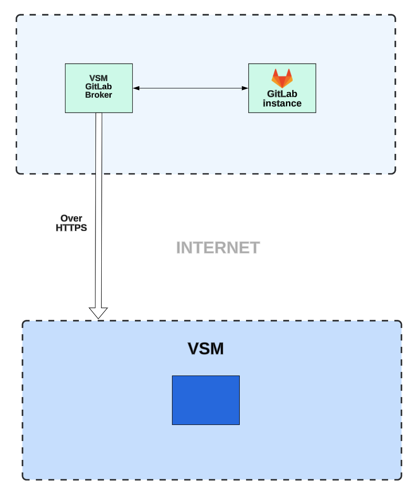

# VSM GitLab Broker

VSM GitLab Broker is used to establish the communication between VSM SaaS Application and GitLab Enterprise on premise
deployments that are not publicly accessible from the internet.

VSM GitLab Broker runs on customers' premises, connects to GitLab Enterprise deployments and transmits the necessary
data to VSM SaaS Application.

<h2 align="center">Table of Contents </h2>

TODO!

1. [Usage](#usage)
    1. [Command-line arguments](#command-line-arguments)
    2. [*Optional:* Webhook Configuration](#optional-webhook-configuration)
2. [Troubleshooting](#troubleshooting)
    1. [Using a Proxy](#using-over-a-http-proxy-system)
    2. [SSL interception](#using-over-ssl-intercepting-proxy)
    3. [Using with M1 chips](#using-amd64-images-on-apple-m1)
3. [Release Process](#release-process)
4. [Broker Architecture](#broker-architecture)

---

### VSM GitLab Broker Diagram

[edit-diagram](https://lucid.app/lucidchart/83343550-f515-4df4-bb43-5243bc48fed8/edit?invitationId=inv_d2794ef6-9509-428e-9695-f8e16e1ced34&page=EaJ5uqZUZvEGp#)